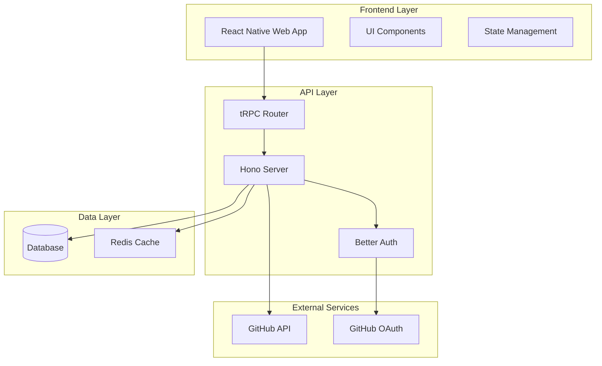

# Design Document: GitHub Dashboard

## Overview

The GitHub Dashboard is a full-stack application that replicates GitHub's activity dashboard interface, providing users with insights into their coding activity, trends, and project statistics. The system uses a modern tech stack with Hono as the API server, tRPC for type-safe communication, better-auth for authentication, and React Native Web for cross-platform compatibility.

The architecture follows a client-server pattern where the frontend (React Native Web) communicates with the backend (Hono + tRPC) through type-safe API calls. GitHub integration is achieved through OAuth2 authentication and REST API calls to fetch real user activity data.

## Architecture

### High-Level Architecture



### Technology Stack

**Frontend:**
- React Native Web for cross-platform UI
- tRPC client for type-safe API calls
- React Query for data fetching and caching
- NativeWind for styling (Tailwind CSS for React Native)

**Backend:**
- Hono framework for HTTP server
- tRPC for type-safe API endpoints
- Better-auth for authentication
- Drizzle ORM for database operations
- Redis for caching GitHub API responses

**External Integrations:**
- GitHub OAuth2 for authentication
- GitHub REST API for activity data
- GitHub Webhooks for real-time updates (optional)

## Components and Interfaces

### Frontend Components

#### 1. Dashboard Layout Component
```typescript
interface DashboardLayoutProps {
  user: User;
  children: React.ReactNode;
}

interface User {
  id: string;
  username: string;
  avatarUrl: string;
  githubConnected: boolean;
}
```

#### 2. Activity Metrics Component
```typescript
interface ActivityMetricsProps {
  metrics: ActivityMetrics;
  loading: boolean;
}

interface ActivityMetrics {
  todayCommits: number;
  weeklyCommits: number;
  monthlyCommits: number;
  percentageChange: number;
  trend: 'up' | 'down' | 'stable';
}
```

#### 3. Trend Chart Component
```typescript
interface TrendChartProps {
  data: TrendData[];
  timeRange: 'week' | 'month' | 'year';
  onTimeRangeChange: (range: string) => void;
}

interface TrendData {
  date: string;
  commits: number;
  additions: number;
  deletions: number;
}
```

#### 4. Calendar Heatmap Component
```typescript
interface CalendarHeatmapProps {
  data: CalendarData[];
  year: number;
  onDateClick: (date: string) => void;
}

interface CalendarData {
  date: string;
  count: number;
  level: 0 | 1 | 2 | 3 | 4; // GitHub-style intensity levels
}
```

#### 5. Project Statistics Component
```typescript
interface ProjectStatsProps {
  projects: ProjectStats[];
  loading: boolean;
}

interface ProjectStats {
  name: string;
  commits: number;
  language: string;
  lastActivity: string;
  url: string;
}
```

### Backend API Interfaces

#### 1. tRPC Router Structure
```typescript
export const appRouter = router({
  auth: authRouter,
  dashboard: dashboardRouter,
  github: githubRouter,
});

export type AppRouter = typeof appRouter;
```

#### 2. Authentication Router
```typescript
const authRouter = router({
  getSession: publicProcedure.query(),
  connectGitHub: protectedProcedure.mutation(),
  disconnectGitHub: protectedProcedure.mutation(),
});
```

#### 3. Dashboard Router
```typescript
const dashboardRouter = router({
  getMetrics: protectedProcedure
    .input(z.object({ timeRange: z.enum(['week', 'month', 'year']) }))
    .query(),
  getTrendData: protectedProcedure
    .input(z.object({ timeRange: z.enum(['week', 'month', 'year']) }))
    .query(),
  getCalendarData: protectedProcedure
    .input(z.object({ year: z.number() }))
    .query(),
});
```

#### 4. GitHub Integration Router
```typescript
const githubRouter = router({
  syncData: protectedProcedure.mutation(),
  getRepositories: protectedProcedure.query(),
  getCommits: protectedProcedure
    .input(z.object({ repo: z.string(), since: z.date().optional() }))
    .query(),
});
```

## Data Models

### Database Schema

#### 1. Users Table
```typescript
interface User {
  id: string;
  email: string;
  username: string;
  avatarUrl?: string;
  githubId?: string;
  githubAccessToken?: string; // encrypted
  createdAt: Date;
  updatedAt: Date;
}
```

#### 2. GitHub Activities Table
```typescript
interface GitHubActivity {
  id: string;
  userId: string;
  type: 'commit' | 'pull_request' | 'issue' | 'release';
  repositoryName: string;
  repositoryUrl: string;
  commitSha?: string;
  message?: string;
  additions?: number;
  deletions?: number;
  timestamp: Date;
  createdAt: Date;
}
```

#### 3. Repositories Table
```typescript
interface Repository {
  id: string;
  userId: string;
  githubId: number;
  name: string;
  fullName: string;
  description?: string;
  language?: string;
  isPrivate: boolean;
  url: string;
  lastSyncAt?: Date;
  createdAt: Date;
  updatedAt: Date;
}
```

#### 4. Daily Statistics Table
```typescript
interface DailyStats {
  id: string;
  userId: string;
  date: Date;
  commits: number;
  additions: number;
  deletions: number;
  repositories: number;
  createdAt: Date;
}
```

### GitHub API Integration Models

#### 1. GitHub User Response
```typescript
interface GitHubUser {
  id: number;
  login: string;
  avatar_url: string;
  name: string;
  email: string;
  public_repos: number;
  followers: number;
  following: number;
}
```

#### 2. GitHub Repository Response
```typescript
interface GitHubRepository {
  id: number;
  name: string;
  full_name: string;
  description: string;
  private: boolean;
  html_url: string;
  language: string;
  created_at: string;
  updated_at: string;
  pushed_at: string;
}
```

#### 3. GitHub Commit Response
```typescript
interface GitHubCommit {
  sha: string;
  commit: {
    message: string;
    author: {
      name: string;
      email: string;
      date: string;
    };
  };
  stats: {
    additions: number;
    deletions: number;
    total: number;
  };
}
```

## Correctness Properties

*A property is a characteristic or behavior that should hold true across all valid executions of a system-essentially, a formal statement about what the system should do. Properties serve as the bridge between human-readable specifications and machine-verifiable correctness guarantees.*

### Property Reflection

After analyzing all acceptance criteria, several properties can be consolidated to eliminate redundancy:

- Authentication flow properties (1.1-1.4) can be combined into comprehensive authentication behavior tests
- Activity display properties (2.1, 2.2, 2.4) focus on different aspects and should remain separate
- Trend visualization properties (3.1-3.3) test different UI behaviors and should remain separate
- Calendar properties (5.1-5.4) test different interaction patterns and should remain separate
- GitHub integration properties (8.1-8.6, 9.1-9.4) cover different integration aspects and should remain separate

### Authentication Properties

**Property 1: Authentication redirect behavior**
*For any* unauthenticated user request to protected routes, the system should redirect to the login page
**Validates: Requirements 1.1**

**Property 2: Session creation on valid authentication**
*For any* valid credential combination, successful authentication should create a valid session
**Validates: Requirements 1.2**

**Property 3: Personalized content display**
*For any* authenticated user, the dashboard should display content specific to that user's account
**Validates: Requirements 1.3**

**Property 4: Session invalidation on logout**
*For any* authenticated user, logout should invalidate the session and redirect to login
**Validates: Requirements 1.4**

### Activity Tracking Properties

**Property 5: Current day commit count accuracy**
*For any* day with activity data, the displayed commit count should match the actual number of commits for that day
**Validates: Requirements 2.1**

**Property 6: Percentage change calculation**
*For any* two time periods with activity data, the percentage change calculation should be mathematically correct
**Validates: Requirements 2.2**

**Property 7: Real-time activity updates**
*For any* activity data change, the UI should reflect the updated information automatically
**Validates: Requirements 2.4**

### Trend Visualization Properties

**Property 8: Weekly trend graph completeness**
*For any* week period, the trend graph should display activity levels for all seven days
**Validates: Requirements 3.1, 3.2**

**Property 9: Trend hover interaction**
*For any* trend data point, hovering should display detailed information for that specific point
**Validates: Requirements 3.3**

### Project Statistics Properties

**Property 10: Project statistics accuracy**
*For any* set of project data, the displayed commit frequency statistics should match the actual commit counts
**Validates: Requirements 4.1**

**Property 11: Time period aggregation**
*For any* specified time period, project metrics should correctly aggregate all data within that period
**Validates: Requirements 4.2**

**Property 12: Project data reactivity**
*For any* project data change, the statistics should update automatically to reflect the new data
**Validates: Requirements 4.3**

### Calendar Integration Properties

**Property 13: Calendar activity indicators**
*For any* month with activity data, the calendar should show appropriate visual indicators for dates with activity
**Validates: Requirements 5.1, 5.2**

**Property 14: Calendar date interaction**
*For any* clickable calendar date, clicking should display detailed activity information for that specific date
**Validates: Requirements 5.3**

**Property 15: Calendar navigation**
*For any* month navigation action, the calendar should load and display the correct activity data for the target month
**Validates: Requirements 5.4**

### API Authentication Properties

**Property 16: API request authentication**
*For any* API request, the server should validate authentication status and return appropriate responses based on authentication state
**Validates: Requirements 6.4**

### Responsive Design Properties

**Property 17: Screen size adaptation**
*For any* screen size within supported ranges, the dashboard should adapt its layout appropriately
**Validates: Requirements 7.3**

**Property 18: Input interaction support**
*For any* supported input type (touch or mouse), the dashboard should respond appropriately to user interactions
**Validates: Requirements 7.4**

### GitHub Integration Properties

**Property 19: OAuth flow initiation**
*For any* user initiating GitHub connection, the system should properly redirect to GitHub's OAuth flow
**Validates: Requirements 8.1**

**Property 20: OAuth token storage**
*For any* successful GitHub OAuth completion, the access token should be stored securely in the database
**Validates: Requirements 8.2**

**Property 21: GitHub API data fetching**
*For any* GitHub data request, the system should use the GitHub REST API correctly and return properly formatted data
**Validates: Requirements 8.3**

**Property 22: GitHub API rate limit handling**
*For any* GitHub API rate limit response, the system should handle the error gracefully and use cached data when available
**Validates: Requirements 8.4**

**Property 23: GitHub data display accuracy**
*For any* GitHub data received, the dashboard should display commits, issues, and pull requests accurately
**Validates: Requirements 8.5**

**Property 24: Mock data fallback**
*For any* user without GitHub integration, the dashboard should function correctly using mock data
**Validates: Requirements 8.6**

### Data Synchronization Properties

**Property 25: Periodic GitHub sync**
*For any* configured sync interval, the system should fetch the latest GitHub activity data at the specified frequency
**Validates: Requirements 9.1**

**Property 26: Database update on new activity**
*For any* new GitHub activity detected, the local database should be updated with the new information
**Validates: Requirements 9.2**

**Property 27: Webhook processing**
*For any* valid GitHub webhook payload, the system should process the update and reflect changes in the dashboard
**Validates: Requirements 9.3**

**Property 28: Sync failure retry logic**
*For any* GitHub data sync failure, the system should retry with exponential backoff until successful or maximum retries reached
**Validates: Requirements 9.4**

### Real-time Update Properties

**Property 29: Server data change propagation**
*For any* data change on the server, connected clients should receive and display the updated information automatically
**Validates: Requirements 10.1**

**Property 30: Offline state handling**
*For any* network connectivity loss, the dashboard should gracefully handle the offline state and continue functioning with cached data
**Validates: Requirements 10.3**

**Property 31: Reconnection synchronization**
*For any* connectivity restoration after an offline period, the system should synchronize any pending changes and update the UI
**Validates: Requirements 10.4**

<function_calls>
<invoke name="prework">
<parameter name="featureName">github-dashboard

## Error Handling

### Authentication Errors

**OAuth Flow Failures:**
- Invalid or expired GitHub OAuth tokens should trigger re-authentication flow
- Network failures during OAuth should display user-friendly error messages
- OAuth cancellation should return user to dashboard with appropriate messaging

**Session Management:**
- Expired sessions should automatically redirect to login
- Invalid session tokens should be cleared and user redirected to authentication
- Concurrent session conflicts should be handled gracefully

### GitHub API Integration Errors

**Rate Limiting:**
- GitHub API rate limits should be monitored and respected
- When rate limited, system should use cached data and display staleness indicators
- Rate limit reset times should be tracked and sync resumed automatically

**API Failures:**
- Network timeouts should trigger retry logic with exponential backoff
- Invalid API responses should be logged and fallback to cached data
- GitHub service outages should be detected and communicated to users

**Data Synchronization Errors:**
- Webhook processing failures should be logged and retried
- Database write failures during sync should trigger rollback mechanisms
- Partial sync failures should be tracked and resumed from last successful point

### Frontend Error Handling

**Network Connectivity:**
- Offline detection should trigger offline mode with cached data
- Failed API calls should be queued for retry when connectivity returns
- Real-time connection failures should gracefully degrade to polling

**UI Error States:**
- Component rendering errors should be caught by error boundaries
- Loading states should have reasonable timeouts with error fallbacks
- User input validation errors should provide clear, actionable feedback

**Data Consistency:**
- Stale data should be clearly indicated to users
- Conflicting data updates should be resolved with user confirmation
- Cache invalidation should be handled transparently

## Testing Strategy

### Dual Testing Approach

The testing strategy employs both unit tests and property-based tests to ensure comprehensive coverage:

**Unit Tests:**
- Verify specific examples and edge cases
- Test integration points between components
- Validate error conditions and boundary cases
- Focus on concrete scenarios and known failure modes

**Property-Based Tests:**
- Verify universal properties across all inputs
- Test system behavior with randomized data
- Ensure correctness properties hold under all conditions
- Provide comprehensive input coverage through generation

Both testing approaches are complementary and necessary for robust software validation.

### Property-Based Testing Configuration

**Testing Framework:** Fast-check (for TypeScript/JavaScript)
- Minimum 100 iterations per property test due to randomization
- Each property test must reference its corresponding design document property
- Tag format: **Feature: github-dashboard, Property {number}: {property_text}**

**Test Organization:**
- Each correctness property must be implemented by a single property-based test
- Properties should be tested close to their implementation to catch errors early
- Test generators should be smart and constrain inputs to valid ranges
- Edge cases identified in requirements should be explicitly covered

### Testing Categories

**Authentication Testing:**
- Unit tests for specific OAuth flows and session scenarios
- Property tests for authentication behavior across all user types
- Integration tests for better-auth and GitHub OAuth integration

**GitHub API Integration Testing:**
- Unit tests for specific API responses and error conditions
- Property tests for data transformation and caching behavior
- Mock GitHub API responses for consistent testing

**UI Component Testing:**
- Unit tests for specific user interactions and edge cases
- Property tests for responsive behavior across screen sizes
- Visual regression tests for cross-platform consistency

**Data Synchronization Testing:**
- Unit tests for specific sync scenarios and failure modes
- Property tests for data consistency and retry logic
- End-to-end tests for webhook processing and real-time updates

### Test Data Management

**Mock Data Generation:**
- GitHub API responses should be mocked with realistic data structures
- User activity data should be generated with varied patterns
- Time-based data should cover different periods and edge cases

**Test Database:**
- Separate test database for integration tests
- Database state should be reset between test runs
- Test data should cover various user scenarios and data states

**Performance Testing:**
- Load testing for GitHub API integration under rate limits
- Stress testing for real-time update mechanisms
- Memory usage testing for large activity datasets